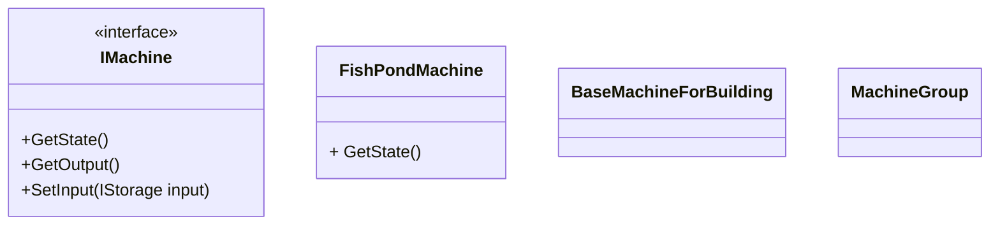

```mermaid
classDiagram
    class IMachine {
         <<interface>>
        +GetState()
        +GetOutput()
        +SetInput(IStorage input) 
    }
    class FishPondMachine {
        + GetState()
        
    }
    class BaseMachineForBuilding {

    }
    class MachineGroup {

    }
```