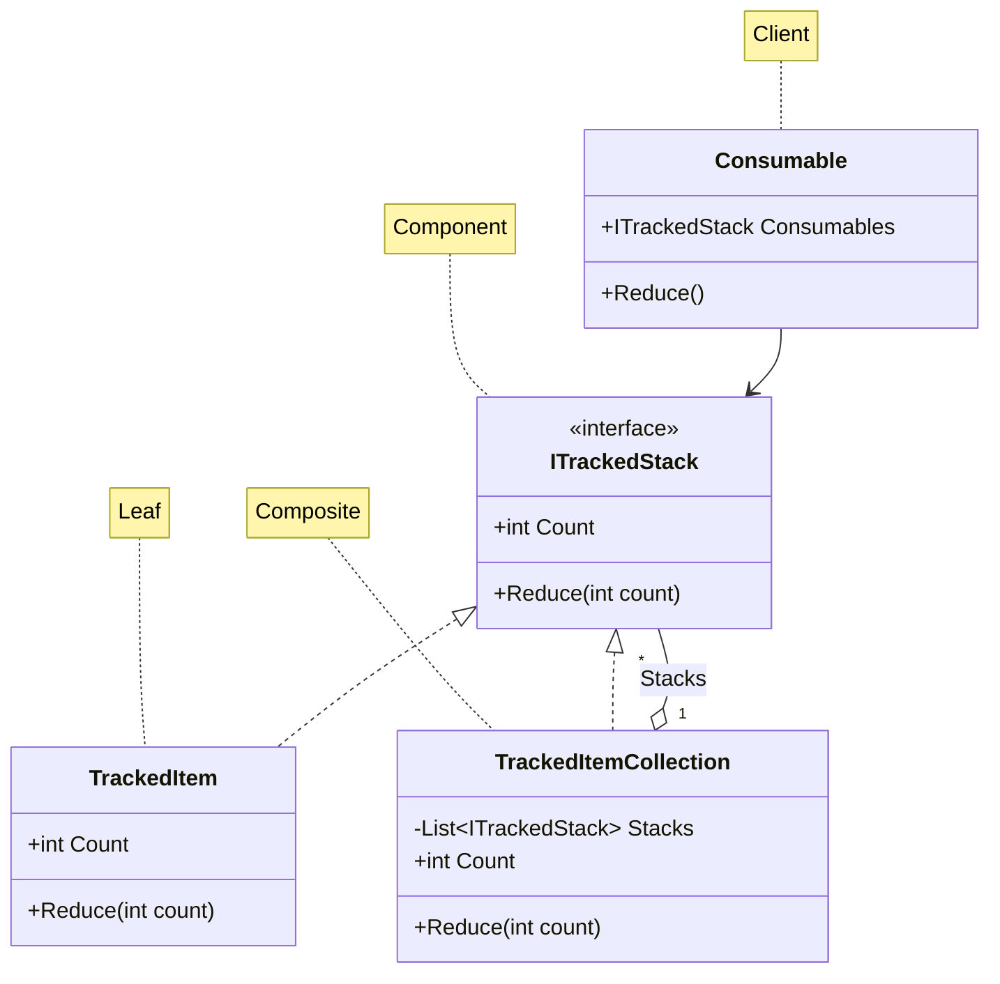

```mermaid
classDiagram
    direction TB

    class ITrackedStack {
        <<interface>>
        +int Count
        +Reduce(int count)
    }

    class TrackedItem {
        +int Count
        +Reduce(int count)
    }

    class TrackedItemCollection {
        -List~ITrackedStack~ Stacks
        +int Count
        +Reduce(int count)
    }

    class Consumable {
        +ITrackedStack Consumables
        +Reduce()
    }

    ITrackedStack <|.. TrackedItem
    ITrackedStack <|.. TrackedItemCollection
    TrackedItemCollection "1" o-- "*" ITrackedStack : Stacks
    Consumable --> ITrackedStack

    note for ITrackedStack "Component"
    note for TrackedItem "Leaf"
    note for TrackedItemCollection "Composite"
    note for Consumable "Client"
```