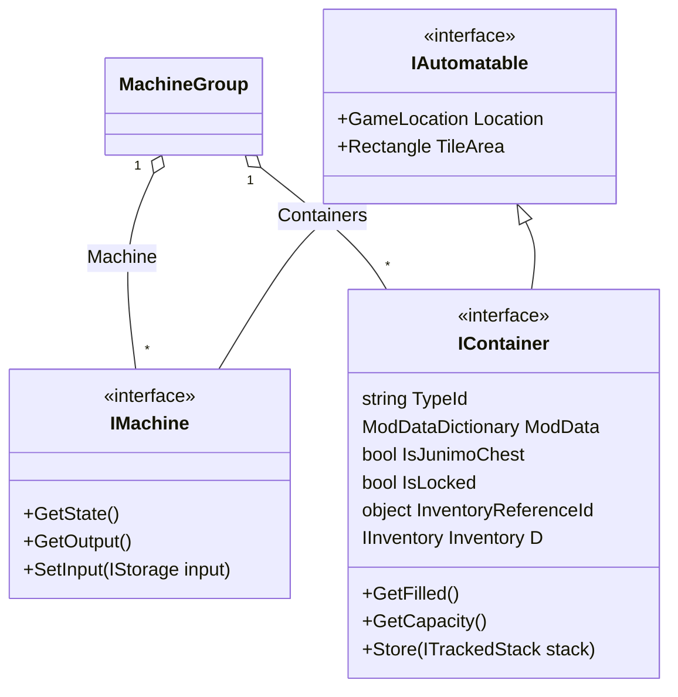

```mermaid
classDiagram 
    %% 최상위 클래스.
    class IAutomatable { 
        <<interface>>
        +GameLocation Location
        +Rectangle TileArea
    }
    class IMachine{
        <<interface>>
        +GetState()
        +GetOutput()
        +SetInput(IStorage input)
    }
    class IContainer {
        <<interface>>
        string TypeId 
        <!-- string Name  -->
        ModDataDictionary ModData 
        bool IsJunimoChest 
        bool IsLocked 
        object InventoryReferenceId 
        IInventory Inventory D
        +GetFilled()
        +GetCapacity()
        +Store(ITrackedStack stack)
    }
    MachineGroup "1" o-- "*" IMachine : Machine
    MachineGroup "1" o-- "*" IContainer : Containers
    IAutomatable <|-- IMachine
    IAutomatable <|-- IContainer
```